* content
{:toc}

南邮的一道16位汇编的题，也算是好好复习了一遍汇编，在64位上运行需要DosBox。于是在xp里面运行

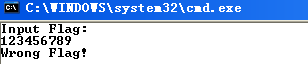

，虽然是16位的程序，但还是可以用32位ida打开，不过不能F5只能看汇编。

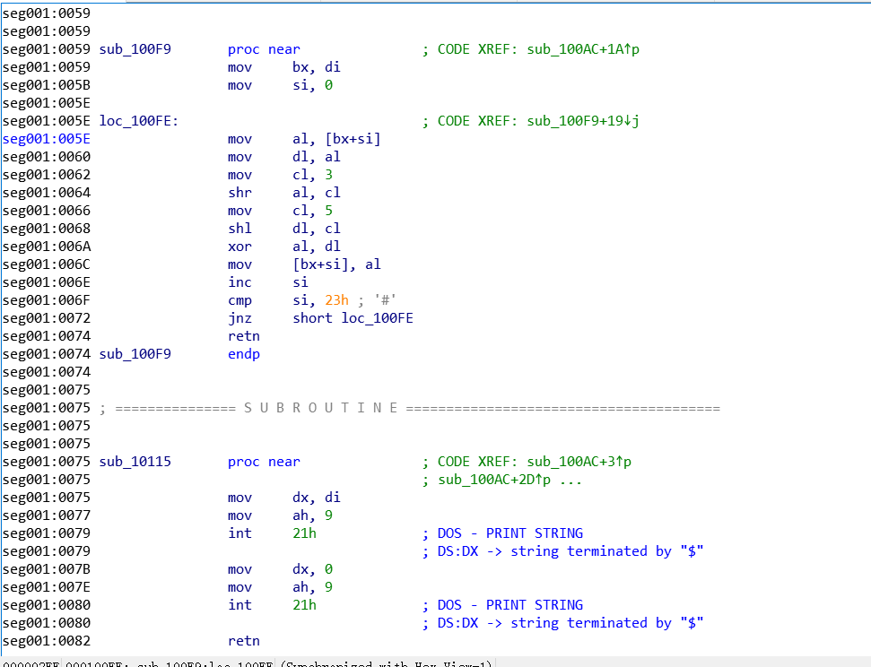

不推荐纯看代码，太累了，还是推荐用动态调试，od不能用但还可以用windows最基本的debug调试。

基本命令:

>   \-t是单句跟踪相当于F7

>   \-p是不进入函数相当于F8

>   \-d看内存的数据

>   \-r看寄存器的值

我们可以发现有很多的int 21h，int
21h是汇编里面非常重要的一个中断，根据ah的值的不同进行不同的作用。具体可以参考:<https://www.cnblogs.com/ynwlgh/archive/2011/12/12/2285017.html>

我们一步一步往下运行可以发现

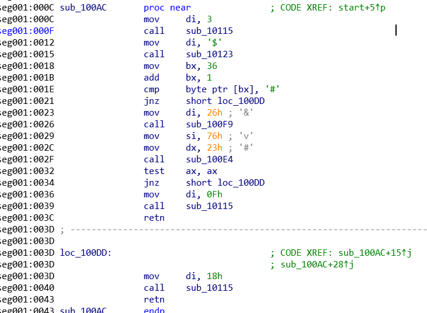

这段是主函数

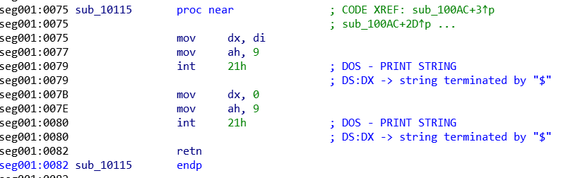

这段是显示字符串的。

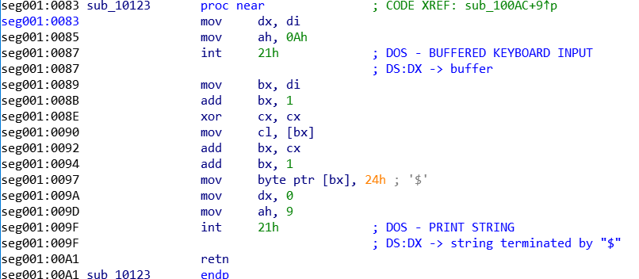

这段是要求我们输入字符串的。比较坑的就是当你输入完字符串后，当前字符串第一个字符的前一个地址存的是输入字符串的长度，之前一直不知道，所以在这上面掉坑里了。

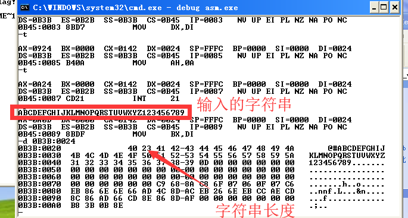

走完输入的函数之后会有一个判断

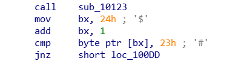

其实也就是判断字符串的长度是否为0x23

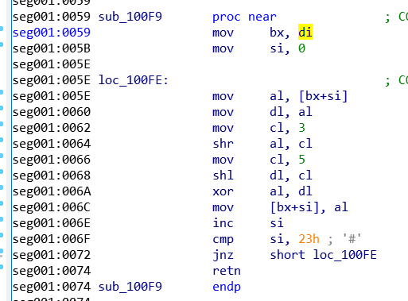

这个函数是把你输入的字符串单个的取出来，然后进行移位操作，右移3位和左移5位。然后把两个数异或之后再存到原来的地址里面。这里要考虑一个问题，就是因为用的是al，只有8位所以将一个数左移5位可能会超过8位，那就会只截取后面8位。所以后面再写脚本的时候需要在移位之后&0xFF就可以了。最后就剩一个比较函数了

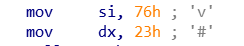

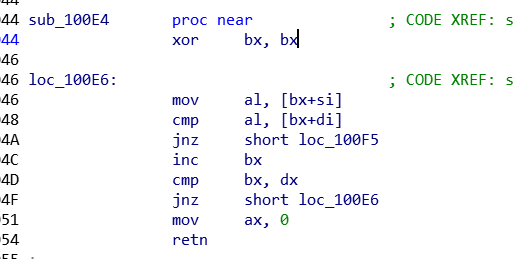

这里di代表的偏移位置是经过异或之后的字符串，si偏移的位置的数据可以在ida这里找

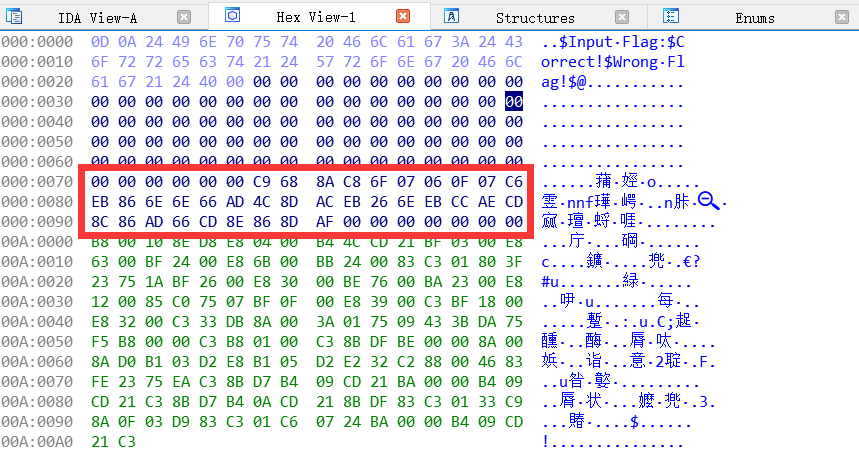

也可以在debug里面找

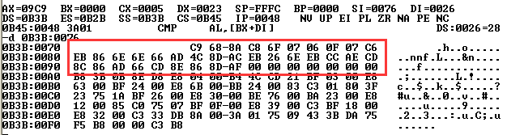

。

最后就可以写脚本了，数据不大，可以直接爆破。

脚本:
	l1='C9 68 8A C8 6F 07 06 0F 07 C6 EB 86 6E 6E 66 AD 4C 8D AC EB 26 6E EB CC AE CD 8C 86 AD 66 CD 8E 86 8D AF'
	l2=l1.split(' ')
	\#print(l2)
	flag=[]
	for i in range(35):
		for j in range(33,256):
			a=j\>\>3&0xFF
			b=j\<\<5&0xFF
			c=a\^b
		if c==int(l2[i],16): \#把16进制转成10进制
			flag.append(chr(j))
			break
	print(''.join(flag))
	
再给一个这题c代码的原型
	\#include \<stdio.h\>
	\#include \<string.h\>
	int main()
	{
		puts("Input Flag:");
		char flag[35];
		int flag2[35];
		scanf("%s", flag);
		int exa[] = {201,104,138,200,111,7,6,15,7,198,235,134,110,110,102,173,76,141,172,235,38,110,235,204,174,205,140,134,173,102,205,142,134,141,175};
		if (strlen(flag) != 0x23)
			puts("Wrong Flag!");
		for (int i = 0;i \< strlen(flag);i++)
		{
			int a = flag[i] \<\< 5 & 0xFF,b = flag[i] \>\> 3 & 0xFF;
			flag2[i] = a \^ b;
		}
		for (int i = 0;i \< 35;i++)
		{
			if (flag2[i] != exa[i])
			{
				puts("Wrong Flag!");
				return 0;
			}
		}
	puts("Correct!");
	}
